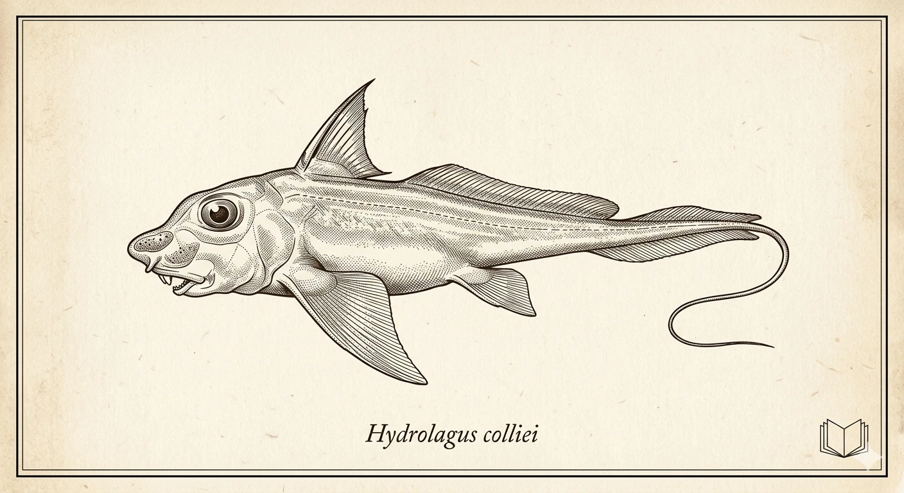

About this Documentation
========================

**Fitzz TeXnik Welt** focuses on maximum readability through modern 
typography using **Fira Sans** and **Fira Code**. While the web documentation 
is optimized with generous line spacing, the EPUB version retains the feel 
of a classic technical manual by using **TeX Gyre** serif fonts.

Typography
----------

We believe that high-quality typography is essential for technical 
understanding. Depending on the output format, we use specifically 
optimized font families created by world-class designers:

.. list-table:: Typography Metadata
   :widths: 20 40 40
   :header-rows: 1
   :class: list-table

   * - Role
     - Web (HTML)
     - Print / EPUB
   * - **Body Text**
     - Fira Sans
     - TeX Gyre Pagella
   * - **Headings**
     - Fira Sans
     - TeX Gyre Heros
   * - **Code**
     - Fira Code
     - TeX Gyre Cursor

Credits & Designers
-------------------

Behind these typefaces and the visual framework are dedicated designers 
whose work enables the clarity of this documentation:

* **Fira Sans & Fira Code:** 
  Designed by :person:`Erik Spiekermann`, :person:`Ralph du Carrois`, 
  :person:`Anja Meiners`, and :person:`Botio Nikoltchev` (Carrois Corporate Mfg.) for 
  the Mozilla Foundation.

* **TeX Gyre Collection:** 
  Created by :person:`B. Jackowski` and :person:`J. M. Nowacki` at 
  the **GUST e-foundry**. Based on the classic designs of :person:`Hermann Zapf` 
  and :person:`Max Miedinger`.

* **Sphinx Nefertiti Theme:** 
  Designed and developed by :person:`Daniela Rus Morales` and the 
  Nefertiti contributors. Her work provides the elegant, modern 
  framework and the distinctive visual identity of this site.

Licensing
---------

The fonts are used under their respective open-source licenses:

* **Fira Fonts:** Licensed under the **SIL Open Font License (OFL)**.
    
    * `Read the full License (HTML) <https://github.com/bBoxType/FiraSans?tab=License-1-ov-file>`_
    * :download:`Download License (TXT) <_static/fonts/OFL.txt>`

* **TeX Gyre Fonts:** Licensed under the **GUST Font License**.
  
    * **Source:** `GUST e-foundry <http://www.gust.org.pl/projects/e-foundry/tex-gyre>`_
    * :download:`Download License (TXT) <_static/fonts/GUST-FONT-LICENSE.txt>`

The Securify Colophon
----------------------

The Spotted Ratfish (*Hydrolagus colliei*)
^^^^^^^^^^^^^^^^^^^^^^^^^^^^^^^^^^^^^^^^^^

The logo and illustrations of this module feature the **Spotted Ratfish**, 
also known as the **Deep-sea Chimaera** or **Ghost Shark**. We chose this 
animal as the symbol for `securify` for several reasons:

* **Evolutionary Sovereignty:** 
  Chimaeras have existed almost unchanged for over 400 million years. They 
  are survivors in extreme environments—a symbol of the mathematical persistence 
  of our *security logic*.
* **Black-box Nature:** 
  As deep-sea dwellers, they evade easy observation. This reflects the closed, 
  compiled core of `securify`, which shields its defense mechanisms from 
  prying eyes.
* **Dual Identity:** 
  The name "Chimaera" suggests a hybrid creature. In this package, a peaceful 
  interface for the administrator coexists with aggressive defense logic against 
  unauthorized automation.

> **Graphic Note:** 
  The graphical representations were created specifically for this project using 
  modern design techniques and AI-supported illustration to honor the style of 
  classic 19th-century scientific engravings.
